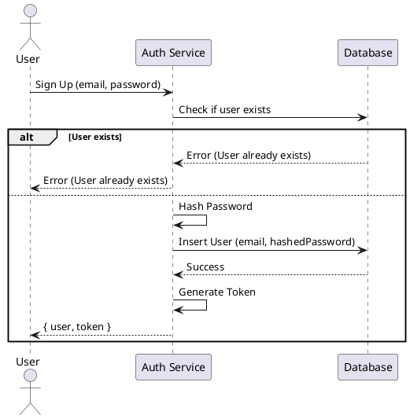
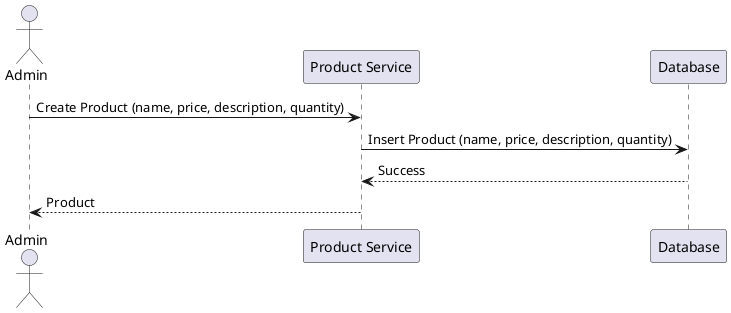
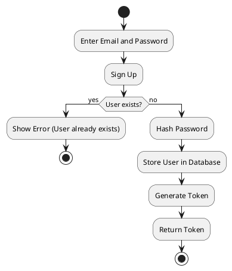

### High-Level Design (HLD) for POS System API

#### Overview
The POS System API is designed to manage a point-of-sale system, providing functionalities for user authentication, product management, upsell product management, and handling sales transactions. This system is built using Fastify, Sequelize, and TypeScript.

### Components

1. **Authentication Service**
   - Handles user sign-up and login.
   - Provides token-based authentication for securing API endpoints.

2. **Product Management Service**
   - CRUD operations for products.
   - Manages product details such as name, price, description, and quantity.

3. **Upsell Product Management Service**
   - Links products to upsell products.
   - Retrieves and manages upsell products.

4. **Transaction Service**
   - Handles sales transactions.
   - Records transaction details including products sold, quantities, and total amount.

### Architecture

1. **Frontend**
   - Not covered in this HLD but assumed to interact with the backend via HTTP requests.

2. **Backend**
   - **Fastify**: Node.js framework used for building the API.
   - **Sequelize**: ORM for interacting with the MySQL database.
   - **JWT**: For handling token-based authentication.

3. **Database**
   - **MySQL**: Relational database used to store user data, product details, upsell links, and transaction records.

### Component Interactions

1. **User Authentication Workflow**
   - User signs up by providing an email and password.
   - The password is hashed and stored in the database.
   - User logs in by providing credentials, which are verified, and a JWT token is generated.

2. **Product Management Workflow**
   - Admin creates, reads, updates, and deletes product details.
   - Products are stored and managed in the database.

3. **Upsell Product Management Workflow**
   - Admin links a product to an upsell product.
   - Retrieves upsell products linked to a specific product.

4. **Sales Transactions Workflow**
   - User creates a sales transaction with product details.
   - Transaction details are stored in the database.

### Detailed Design

#### Data Models

1. **User Model**
   ```ts
   class User extends Model {
     id!: number;
     email!: string;
     password!: string;
   }
   ```

2. **Product Model**
   ```ts
   class Product extends Model {
     id!: number;
     name!: string;
     price!: number;
     description!: string;
     quantity!: number;
   }
   ```

3. **Upsell Model**
   ```ts
   class Upsell extends Model {
     id!: number;
     productId!: number;
     upsellProductId!: number;
   }
   ```

4. **Transaction Model**
   ```ts
   class Transaction extends Model {
     id!: number;
     productId!: number;
     quantity!: number;
     totalAmount!: number;
   }
   ```

#### API Endpoints

1. **Authentication Endpoints**
   - `POST /signup`: Creates a new user.
   - `POST /login`: Authenticates a user and returns a token.

2. **Product Endpoints**
   - `POST /products`: Creates a new product.
   - `GET /products`: Retrieves all products.
   - `PUT /products/:id`: Updates an existing product.
   - `DELETE /products/:id`: Deletes a product.

3. **Upsell Product Endpoints**
   - `POST /upsells`: Links an upsell product.
   - `GET /upsells/:productId`: Retrieves upsell products linked to a product.
   - `DELETE /upsells/:id`: Removes an upsell product link.

4. **Transaction Endpoints**
   - `POST /transactions`: Creates a new transaction.
   - `GET /transactions/:id`: Retrieves details of a transaction.

### High-Level Sequence Diagrams

#### User Sign-Up Sequence


#### Create Product Sequence


### Activity Diagram

#### User Sign-Up Process


### Conclusion

This high-level design provides a clear overview of the POS System API, its components, interactions, and the workflows involved. This should serve as a foundation for detailed implementation and further refinement.